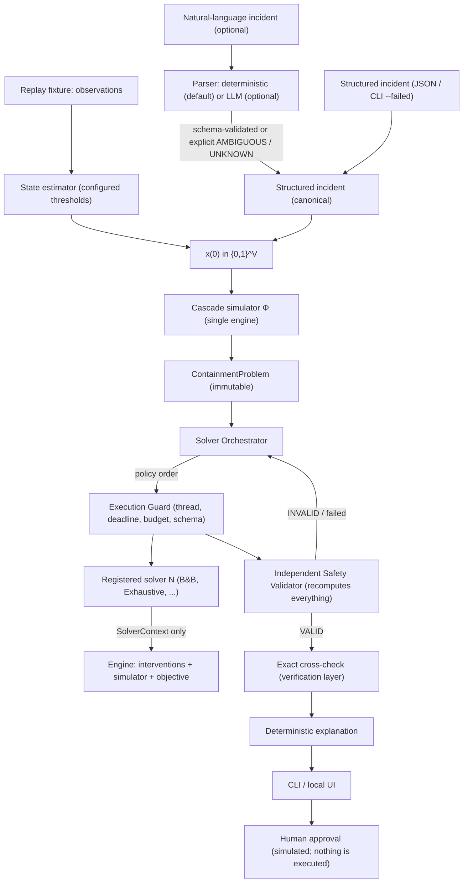

# RippleCut Architecture

## Pipeline



## Solver Independence Invariant (master spec §4)

A solver *searches*; RippleCut *simulates, evaluates and verifies*. A solver receives exactly two objects:

- the frozen `ContainmentProblem`;
- a `SolverContext`, whose `evaluate(plan)`, `optimistic_bound(...)` and `applicable_actions()` route every call
  through the one engine.

A solver cannot define dependency semantics, the objective, legality or validation. It returns a `SolverResult`
that is treated as a *claim*.

| responsibility | exactly one implementation | file |
|---|---|---|
| dependency rules `R_v` | `CompiledRule.evaluate` | `ripplecut/engine/dependency.py` |
| cascade simulator Φ | `phi`, `simulate` | `ripplecut/engine/simulator.py` |
| intervention engine `T_B` + legality | `check_plan`, `transform` | `ripplecut/engine/interventions.py` |
| objective `(C, K, N, R)` + total order | `compute_objective`, `evaluate_plan`, `objective_key` | `ripplecut/engine/objective.py` |
| safety validator | `SafetyValidator` | `ripplecut/validation/validator.py` |

| may be many | current members |
|---|---|
| solvers | `branch_and_bound` (best-first), `branch_and_bound_dfs`, `exhaustive`; the tests register many more, up to 30 in a single registry |

`tests/test_architecture_integrity.py` enforces these tables statically (AST checks):

- one definition of each core component exists;
- solver modules import none of the simulator, dependency, intervention, validation, UI, LLM or pipeline modules;
- solver modules call none of the engine functions directly;
- the decision path (pipeline, orchestrator, guard, validator, engine, explain, incident, evidence, UI) never
  names an algorithm.

The one place that names concrete solver classes is `ripplecut/solvers/builtin.py`, the registration point.

## Solver framework

| component | file | role |
|---|---|---|
| Solver interface | `solvers/base.py` | `Solver` ABC: `name`, `capabilities` (EXACT or HEURISTIC, `max_actions`), `supports()`, `solve()`. Also `SolverResult`, `SolverContext`, status enums |
| Registry | `solvers/registry.py` | explicit instances (no globals); `register`, `get`, `list_available`, `with_override` (used by fault injection) |
| Policy | `solvers/policy.py` + `config/solver_policy.json` | enabled / primary / fallback order, limits, `validation.required = true` (mandatory), timeout policy, verification |
| Execution guard | `solvers/guard.py` | runs a solver in a thread with deadline + evaluation budget and converts every failure into a normalized status: INCOMPATIBLE, ERROR, TIMEOUT, RESOURCE_LIMIT, INVALID_RESULT. The guard's runtime is authoritative |
| Orchestrator | `solvers/orchestrator.py` | policy order → guard → validator → accept the first valid result or fall back → `NO_VALID_SOLVER_RESULT` (never a fabricated plan). Derives the optimality label itself; runs the exact cross-check; can refute an uncertified infeasibility claim |
| Fault injection | `solvers/fault_injection.py` | "Solver failure simulation / resilience test": crash, timeout, invalid_action, wrong_cost, malformed; keeps the target's name so the orchestrator treats it as the real solver |

**Adding an algorithm** means implementing `Solver`, registering it, and optionally listing it in
`config/solver_policy.json`. Nothing else changes. `tests/test_solver_architecture.py` demonstrates this with
2, then 3 trivial solvers and with a 30-solver fallback chain.

## Trust boundary (master spec §35)

```
solver output (untrusted claim)
  -> result schema validation         (guard)
  -> plan validation / known actions  (validator 1-2)
  -> legality                         (validator 3)
  -> T_B applied                      (validator 4)
  -> cascade re-run                   (validator 5)
  -> objective recomputed             (validator 6-9)
  -> reported vs recomputed           (validator 10)
  -> exact cross-check                (orchestrator verification layer)
  -> final result
```

LLM output is a second untrusted input. It is parsed as JSON, restricted to the allowed keys, checked against
the model's service ids, and passed through the same root-vs-symptom ambiguity check as the deterministic
parser. LLM-written explanations must pass `explain/llm_explainer.py:check_explanation`, or the deterministic
text is used instead.

## Package map

```
ripplecut/
  errors.py               structured error codes (master spec §101)
  logs.py                 JSON structured events (§66); per-run recorder
  model/                  schema (frozen dataclasses), loader, semantic validation (GATE 1)
  engine/                 dependency rules, simulator, interventions, objective  <- the single engine
  solvers/                base, registry, policy, guard, orchestrator, builtin, fault_injection,
                          branch_and_bound, exhaustive
  validation/validator.py independent safety validator + infeasibility certificate
  incident/               structured schema, deterministic parser, optional LLM parser (stdlib HTTP)
  evidence/               state estimator, replay fixtures, RCAEval adapter boundary
  explain/                deterministic explainer, LLM explanation guard
  pipeline.py             end-to-end run report (solver-agnostic)
  generators.py           seeded random models (property tests, benchmark)
  benchmark.py            measured Exhaustive vs B&B report
  cli.py, __main__.py     command line
  ui/server.py, ui/static/index.html   offline stdlib HTTP server + single-page UI (no CDN)
config/                   canonical model, solver policy, scenarios, SYNTHETIC replay fixture
tests/                    pytest suite (gates 1-12, §114-§122)
docs/                     this file, mathematics, topology, validation, benchmark, judge Q&A, report
scripts/                  doc generators
```

## Runtime and dependencies

- Python ≥ 3.10 (built and tested on 3.12.3), standard library only at runtime.
- `pytest` is needed only to run the tests.
- The optional LLM path uses `urllib` and reads `ANTHROPIC_API_KEY` from the environment. It is off unless
  `--llm` is passed and a key is set.
- No network access is needed for the demo, the UI or the tests (`tests/test_scenarios_e2e.py::test_demo_runs_offline`
  blocks sockets and runs the full demo).
